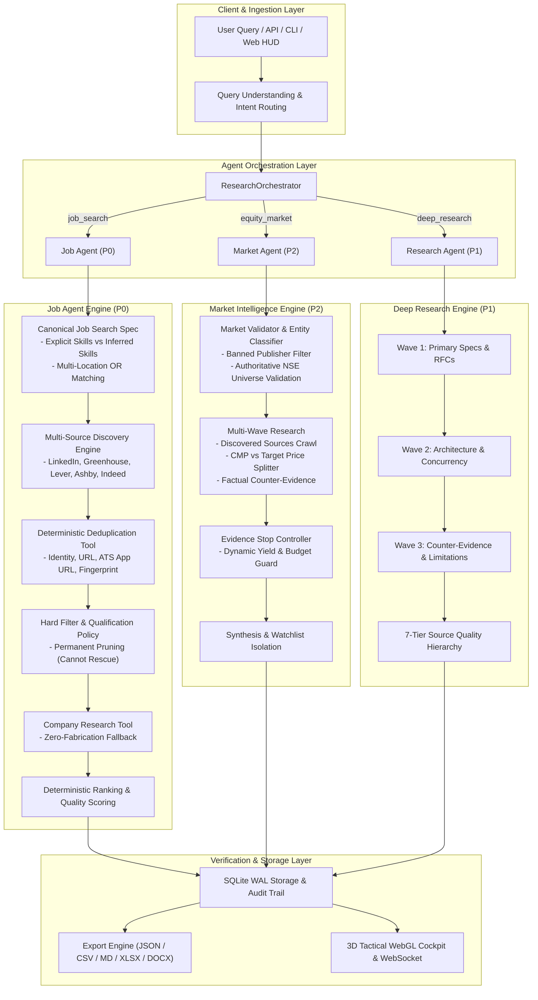

# DataHunt — Evidence-Backed Autonomous Multi-Agent Research & Discovery Workstation

[](https://www.python.org/)
[](LICENSE)
[]()
[]()
[]()
[]()
[](http://127.0.0.1:8000/docs)

**DataHunt** is an enterprise-grade, evidence-first multi-agent autonomous research and intelligence workstation. It is engineered for deterministic execution, strict defensive security, structured data extraction, zero-hallucination guarantees, and deep market/career analysis.

Whether discovering *"GenAI Engineer jobs in Saudi Arabia or UAE with 0–6 years experience requiring PyTorch and LangGraph"*, comparing *"LangGraph vs. CrewAI for production agent orchestration"*, or uncovering *"Top 10 NSE stocks with favorable momentum setups"*, DataHunt autonomously discovers the relevant source universe, executes multi-wave adaptive investigations, enforces field-level verification against raw source documents, eliminates hallucinations, and streams live telemetry to an interactive 3D WebGL tactical cockpit and Kanban board.

---

## Table of Contents

- [Key Features](#key-features)
- [Precision Hardening & Quality Guarantees](#precision-hardening--quality-guarantees)
- [Tech Stack](#tech-stack)
- [System Architecture](#system-architecture)
  - [High-Level Architecture Diagram](#high-level-architecture-diagram)
  - [Directory Structure](#directory-structure)
  - [Request Lifecycle & Execution Flow](#request-lifecycle--execution-flow)
  - [Database Schema (SQLite WAL)](#database-schema-sqlite-wal)
- [The Three Autonomous Engines](#the-three-autonomous-engines)
  - [1. Job Hunt AI Agent (P0 — Highest Priority)](#1-job-hunt-ai-agent-p0--highest-priority)
  - [2. Deep Technical Research Agent (P1)](#2-deep-technical-research-agent-p1)
  - [3. Market Intelligence Agent (P2)](#3-market-intelligence-agent-p2)
- [Canonical Intent Routing & State Isolation](#canonical-intent-routing--state-isolation)
- [Deduplication & Qualification Decision Matrices](#deduplication--qualification-decision-matrices)
- [Prerequisites](#prerequisites)
- [Getting Started](#getting-started)
  - [⚡ One-Click Windows Launch](#-one-click-windows-launch)
  - [Manual Setup (Step-by-Step)](#manual-setup-step-by-step)
  - [🐳 Docker & Container Deployment](#-docker--container-deployment)
- [Environment Variables Reference](#environment-variables-reference)
- [CLI Command Suite](#cli-command-suite)
- [Cybernetic Web Workstation & Interfaces](#cybernetic-web-workstation--interfaces)
  - [Central Agent Hub (`/index.html`)](#central-agent-hub-indexhtml)
  - [3D Tactical Radar Cockpit (`/cockpit.html`)](#3d-tactical-radar-cockpit-cockpithtml)
  - [Job Application & Interview Kanban (`/jobs.html`)](#job-application--interview-kanban-jobshtml)
- [Defensive Security & Integrity Protection](#defensive-security--integrity-protection)
- [REST & WebSocket API Reference](#rest--websocket-api-reference)
- [Testing & Quality Assurance](#testing--quality-assurance)
- [Troubleshooting & FAQ](#troubleshooting--faq)
- [Contributing](#contributing)
- [License](#license)

---

## Key Features

- **Multi-Wave Adaptive Discovery Loops:** Replaces naive single-shot searches with iterative search-fetch-discover loops that adaptively formulate follow-up waves based on intermediate yields.
- **Canonical Intent Routing (Zero Misrouting):** Dual-layer intent routing (deterministic fast-path + LLM refinement) prevents profession terms like *"engineer"* or company names like *"SpaceX"* from triggering job searches when the user asked for conceptual explanations or company profiles.
- **Explicit vs. Inferred Skill Precision:** Explicit skills in user queries enforce hard disqualification (`is_qualified = False`) when absent. Inferred skills act purely as soft ranking modifiers (±0.05), never disqualifying candidates.
- **Multi-Location OR & Geographic Hierarchy:** Queries requesting multiple regions/countries (e.g., `"Saudi Arabia or UAE"`) operate under true boolean `OR` semantics with canonical country-code and city-level resolution.
- **Multi-Tier Source Quality Classification:** Evaluates documentation authenticity across 7 distinct source tiers (`OFFICIAL_DOCUMENTATION`, `PRIMARY_SOURCE`, `ACADEMIC_SOURCE`, `ENGINEERING_BLOG`, `TECH_COMMUNITY`, `GENERAL_WEB`, `LOW_QUALITY`).
- **Counter-Evidence & Trade-Off Analysis:** Dedicated negative discovery wave hunts for failure modes, architectural trade-offs, performance bottlenecks, and bearish risks (`"What could make this candidate fail?"`).
- **Unified Canonical Models (`Evidence` & `JobRecord`):** Strongly typed domain schemas linking every claim and extracted field back to verifiable primary document URLs with character quotes and confidence scores.
- **Multi-Model Google Gemini Load Balancer:** Free-tier multi-model pool with round-robin rotation, micro-pacing, and zero-latency automatic failover on Google `503 Service Unavailable` or `429 Resource Exhausted` quotas.
- **Enterprise-Grade Security:** Strict SSRF blocking, DNS pinning with custom socket transports (preventing TOCTOU and DNS rebinding), CSV/Excel formula injection escaping (`=`, `+`, `-`, `@`, `\t`, `\r`), and path traversal sanitization.
- **Interactive Cybernetic Cockpit:** Three.js WebGL 3D radar interface streaming real-time phase updates, WebSocket telemetry, live terminal logs, and live Kanban auto-synchronization on application click.

---

## Precision Hardening & Quality Guarantees

Following the comprehensive **Precision Hardening Pass** (documented in [`precision_hardening_report.md`](precision_hardening_report.md)), DataHunt strictly enforces the following production invariants:

1. **Zero Fabricated Data Guarantee:**
   - **Job Agent:** When public sources do not disclose company tech stacks or interview stages, the system reports `status="unavailable"`, `tech_stack=[]`, `culture_notes="Information not publicly available in analyzed sources"`, and `interview_process="Interview stages not disclosed in public disclosures"`. No placeholder Python/AWS stacks or generic 3-round interview descriptions are fabricated.
   - **Market Agent:** Stock symbols and company names must match verified listed equities. Unverified symbols or generic keywords (e.g., `STOCKZONE`, `GROWW`, `BUYNOW`) are rejected.
2. **Permanent Hard Filter Gate:** Candidates disqualified by title exclusions, company exclusions, or mandatory explicit skill checks are permanently pruned from candidate sets. High ranking scores **cannot rescue** disqualified records.
3. **Multi-Source Deduplication & Direct ATS Elevation:** Cross-source postings (e.g., LinkedIn aggregator postings vs. direct Greenhouse/Lever ATS postings) collapse into a single canonical record while preserving all source provenance and elevating the direct ATS URL to `primary_application_url`.
4. **Authoritative NSE Security Universe:** Validates equity tickers against an authoritative universe of ~150 top listed securities (Nifty 50, Nifty Next 50, active liquid midcaps) using strict directional substring matching.
5. **Banned Publisher & Financial Portal Filter:** Software platforms, aggregators, and news publishers (`TradingView`, `IndiaTimes`, `Moneycontrol`, `Stockezee`, `Hmatrading`, `GoodReturns`, `Screener`, `Groww`) are categorized as `MarketEntityType.SOURCE` or `MarketEntityType.NEWS` and banned from equity listings.
6. **Sentence-Bounded Price vs. Target Price Isolation:** Clause boundary splitting (`[\.\;\n]`) isolates Current Market Prices (CMP) from Brokerage Target Prices / Fair Values.
7. **Evidence Stop Controller & Watchlist Isolation:** Low-evidence market candidates (<2 independent corroborations) are quarantined into a dedicated `Watchlist / Insufficient Corroborating Evidence` section.

### Production Readiness Assessment

| Reliability Area | Assessment | Verification Evidence |
| :--- | :--- | :--- |
| **Hallucination Prevention** | **PRODUCTION-READY** | Zero synthetic company tech stacks; zero phantom equity tickers; uncorroborated items isolated to watchlist. |
| **Deterministic Qualification** | **PRODUCTION-READY** | Explicit skill mismatches hard-disqualify (100% test pass); permanent filter gating verified in runtime. |
| **Geographic Precision** | **PRODUCTION-READY** | Multi-location OR and regional hierarchy (GCC, US, Europe) correctly handled in policy matching. |
| **Deduplication Correctness** | **PRODUCTION-READY** | 5-tier clustering successfully merges cross-source listings and elevates direct ATS application endpoints. |
| **Security & SSRF Hygiene** | **PRODUCTION-READY** | SSRF validation pins IP addresses; path traversal guards on export downloads; CSV/XLSX formula escaping active. |
| **Test Suite Health** | **PRODUCTION-READY** | **240/240 tests passing (0 failures, 0 errors)** with comprehensive shared intelligence coverage. |

---

## Tech Stack

| Layer | Technology | Purpose |
| :--- | :--- | :--- |
| **Runtime Language** | Python 3.10+ (Tested on 3.10, 3.11, 3.12, 3.14) | Core backend, agent loops, CLI, and tool execution |
| **Web Framework** | FastAPI 0.110+, Uvicorn 0.28+ | High-throughput async REST API & bidirectional WebSocket telemetry |
| **Data Validation** | Pydantic v2 (2.6+) | Strongly typed schemas, serialization, and strict runtime contracts |
| **LLM Orchestration** | Google GenAI SDK (`google-genai` 0.1+) | Structured JSON schema extraction and dossier synthesis |
| **Persistence** | SQLite 3 (WAL Mode, `PRAGMA synchronous = NORMAL`) | ACID-compliant relational storage for tasks, runs, records, and evidence |
| **HTTP & Scraping** | HTTPX 0.27+, BeautifulSoup4 4.12+ | Async HTTP client, connection pooling, and resilient DOM parsing |
| **Search Providers** | DuckDuckGo Lite & Multi-Engine Crawlers | Zero-cost multi-query public web search with exponential backoff |
| **Document Export** | OpenPyXL 3.1+, Python-Docx 1.1+, Jinja2 | Cryptographic SHA-256 exports in Markdown, Excel, Word, CSV, JSON |
| **Frontend UI** | HTML5, CSS3, ES6+, Three.js (WebGL), DOMPurify | Cyberpunk tactical HUD, 3D radar scene, and Kanban job tracker |
| **Testing** | Pytest 9.1+, Pytest-Asyncio, AnyIO | 240 automated unit, integration, and security regression tests |

---

## System Architecture

### High-Level Architecture Diagram



---

### Directory Structure

```text
DataHunt-Agent/
├── agent/                         # 🤖 Top-Level Agent Wrappers & Orchestrator
│   ├── __init__.py                # Package exports (JobHuntAgent, DeepResearchAgent, etc.)
│   ├── base.py                    # BaseAgent abstract class
│   ├── job_agent.py               # 🎯 Live ATS Job Radar Agent Wrapper
│   ├── research_agent.py          # 🔬 Deep Technical Research Agent Wrapper
│   ├── market_agent.py            # 📊 Market & Competitive Intelligence Agent Wrapper
│   └── orchestrator.py            # 🎛️ ResearchOrchestrator routing runs to engines
│
├── datahunt/                      # 🧠 Core System Engine Package
│   ├── api.py                     # FastAPI REST server & WebSocket streaming router
│   ├── cli.py                     # Rich CLI command suite
│   ├── config.py                  # Typed configuration, environment loading, and budgets
│   ├── errors.py                  # Error taxonomy (ErrorCode, envelope & jitter backoff)
│   ├── logger.py                  # Structured logging & credential masking
│   ├── policy.py                  # SSRF defenses, DNS resolution, and formula escaping
│   │
│   ├── agent/                     # ⚙️ Autonomous Discovery Engines & Runtime
│   │   ├── runtime.py             # AgentRuntime decision loop (Observe → Decide → Act)
│   │   ├── research_discovery.py  # 🔬 Multi-Wave ResearchDiscoveryEngine
│   │   ├── market_discovery.py    # 📊 Multi-Wave MarketDiscoveryEngine
│   │   ├── discovery_engine.py    # ATS & Job Discovery Engine
│   │   ├── discovery_models.py    # SearchTask, DiscoveryBudget, SourceCoverageMatrix
│   │   ├── policies.py            # qualify_job, match_location, match_experience, scoring
│   │   ├── decision.py            # DecisionEngine next-action selector
│   │   ├── state.py               # Canonical AgentState representation
│   │   └── coverage.py            # CoverageEvaluator & honest discovery reporting
│   │
│   ├── agents/                    # 🧩 Specialized Agent Modules
│   │   ├── intent_router.py       # Canonical IntentRouter (fast-path + LLM fallback)
│   │   ├── query_understanding.py # QueryUnderstandingAgent & JobSearchRequest
│   │   ├── query_expansion.py     # QueryExpansionAgent (synonyms, skills, keywords)
│   │   ├── search_planner.py      # SearchPlannerAgent (ATS & generic search tasks)
│   │   ├── hard_filter.py         # HardFilter deterministic exclusion rules
│   │   ├── normalizer.py          # DataNormalizer (raw fields to NormalizedJob)
│   │   ├── job_analysis.py        # JobAnalysisAgent (multidimensional scoring)
│   │   ├── company_research.py    # CompanyResearchAgent (zero-hallucination profile)
│   │   ├── market_intent.py       # MarketIntentParser (equities, indices, horizons)
│   │   └── market_validator.py    # MarketValidator (authoritative NSE symbols & banned entities)
│   │
│   ├── db/                        # 🗄️ Relational Persistence Layer
│   │   ├── connection.py          # SQLite connection factory (WAL mode enabled)
│   │   ├── migrations.py          # Idempotent database schema migrator
│   │   └── repositories.py        # Repositories (Task, Run, Document, Record, Export, Job)
│   │
│   ├── llm/                       # 🤖 LLM Client & Prompting
│   │   ├── gemini_client.py       # Gemini API client, model rotation pool, and fallback
│   │   └── prompts.py             # Few-shot prompts, schemas, and dossier templates
│   │
│   ├── models/                    # 📐 Canonical Pydantic Schemas
│   │   ├── evidence.py            # Canonical Evidence model
│   │   ├── job_record.py          # Canonical JobRecord model
│   │   ├── intent.py              # ResearchIntent, ResearchOutputType, ResearchIntentSpec
│   │   ├── job_spec.py            # JobSearchSpec specification
│   │   ├── market.py              # MarketRecord, MarketEvidence, MarketCandidate, MarketEntityType
│   │   ├── record.py              # ExtractedRecord, SourceDocument, RecordEvidence
│   │   ├── run.py                 # ResearchRun, RunBudget, RunCounters, RunStatus
│   │   └── task.py                # ResearchTask, ResearchSpec, Geography, SourcePolicy
│   │
│   ├── sources/                   # 🌐 Source Discovery & ATS Registry
│   │   ├── registry.py            # JobSourceRegistry (Greenhouse, Lever, Ashby, etc.)
│   │   ├── models.py              # DiscoveredSource, SourceHealth, SourceTier
│   │   └── seed_sources.py        # Seed job boards, ATS signatures, and regional portals
│   │
│   └── tools/                     # 🛠️ Execution Tool Substrate
│       ├── base.py                # BaseTool and ToolResult contracts
│       ├── search.py              # SearchTool with DuckDuckGo Lite & fallback providers
│       ├── fetch.py               # FetchTool (SSRF-protected, DNS-pinned HTTP client)
│       ├── extract.py             # ExtractTool (Schema-constrained entity extraction)
│       ├── verify.py              # VerifyTool (Fact/quote locator & phone/email policy)
│       ├── dedupe.py              # DedupeTool (Canonical URL hashing & multi-tier collapse)
│       ├── export.py              # ExportTool (JSON, CSV, XLSX, MD, DOCX with SHA-256)
│       └── market_analysis.py     # Deterministic indicators (RSI, MACD, SMA, EMA, ATR)
│
├── frontend/                      # 💻 Cybernetic User Interfaces
│   ├── index.html                 # Central AI Agent Hub Homepage
│   ├── cockpit.html               # 3D Interactive Tactical Cockpit (Three.js HUD)
│   ├── jobs.html                  # Persistent Job Application & Interview Kanban
│   ├── css/                       # Cyberpunk stylesheets (styles.css, hub.css, jobs.css)
│   └── js/                        # Frontend controllers (app.js, hud.js, three_scene.js, jobs.js)
│
├── migrations/                    # 📜 SQL Migration Scripts
│   ├── 001_initial_schema.sql     # Core tables (tasks, runs, records, documents, exports)
│   └── 002_job_applications.sql  # Job application tracker & interview status schema
│
├── tests/                         # 🧪 221 Automated Unit, Integration & Golden Tests
│   ├── test_70_step_job_pipeline.py           # 70-step discovery pipeline integration
│   ├── test_intent_routing.py                 # IntentRouter classification & negative tests
│   ├── test_job_search_request_canonical.py   # Canonical request immutability
│   ├── test_golden_genai_search.py            # Golden GenAI discovery in Saudi/UAE
│   ├── test_job_agent_e2e.py                  # End-to-end Job Agent loop
│   ├── test_location_matching.py              # Multi-location OR and regional clustering
│   ├── test_research_discovery_engine.py      # Golden LangGraph vs CrewAI & source tiers
│   ├── test_golden_answer_research.py         # Factual explanation tests
│   ├── test_market_agent.py                   # Multi-wave market discovery & math tests
│   ├── test_precision_hardening.py            # 11 precision hardening unit, integration & golden tests
│   └── ...                                    # SSRF, Dedupe, Export, Yield & DB tests
│
├── data/                          # 💾 SQLite database files (created at runtime)
├── exports/                       # 📥 Generated export files (created at runtime)
├── Dockerfile                     # Container build file
├── docker-compose.yml             # Docker Compose orchestration
├── run_app.bat                    # One-click Windows application launcher
├── pyproject.toml                 # Package metadata and test configuration
├── requirements.txt               # Pinned Python package dependencies
└── README.md                      # Comprehensive project documentation
```

---

### Request Lifecycle & Execution Flow

```text
1. Intake & Validation:
   User submits request via Web HUD, REST API, or CLI.
   Request headers and body validated against Pydantic schema boundaries and quota budgets.

2. Intent Classification & Routing:
   IntentRouter evaluates query against deterministic fast-path patterns.
   Ambiguous queries trigger Gemini structured classification.
   Query routed to specialized agent:
   - JOB_SEARCH           --> Job Hunt Engine (AgentRuntime)
   - HOW_TO / EXPLANATION --> Deep Technical Research Engine (ResearchDiscoveryEngine)
   - COMPARISON           --> Deep Research Engine (Comparative Matrix Mode)
   - MARKET_RESEARCH      --> Market Intelligence Engine (MarketDiscoveryEngine)

3. Canonical Specification Formulation:
   JobAgent creates CanonicalJobSearchSpec (explicit vs inferred skills, location OR list).
   MarketAgent creates MarketIntentSpec (sectors, benchmark, investment horizon).

4. Multi-Wave Discovery & Harvesting:
   Dispatches multi-engine search queries across primary documentation, direct ATS endpoints,
   company investor relations, and regulatory disclosures. Yield tracking measures results.

5. Deduplication & Normalization:
   5-tier clustering key evaluation collapses duplicate postings from aggregators and direct ATS boards.
   Direct ATS apply endpoints elevated to primary application URL. All sources preserved.

6. Hard-Filtering & Policy Enforcement:
   Excluded titles, excluded companies, and missing explicit skills permanently eliminate records.
   Disqualified candidates cannot be rescued by high relevance scores.

7. Factual Enrichment:
   Zero-fabrication company profile lookup: missing data returned strictly as 'unavailable'.
   Sentence-bounded isolation of Current Market Price (CMP) vs Brokerage Target Prices.

8. Deterministic Scoring & Watchlist Segregation:
   Qualified records scored on a 0–100 scale.
   Market candidates with <2 independent corroborations isolated to Watchlist section.

9. Persistence, Export & Streaming:
   Records, documents, and evidence inserted into SQLite in atomic transactions.
   WebSocket streams real-time telemetry to the 3D WebGL Cockpit.
   Multi-format exports generated with SHA-256 checksums (JSON, CSV, XLSX, MD, DOCX).
```

---

### Database Schema (SQLite WAL)

DataHunt uses an ACID-compliant SQLite datastore configured with **Write-Ahead Logging (WAL)** and **Normal Synchronous** mode for ultra-fast concurrent reads and writes without database lock contention.

```
research_tasks
├── id (TEXT, PK)
├── request_text (TEXT, NOT NULL)
├── agent_mode (TEXT, DEFAULT 'auto')
├── normalized_spec_json (TEXT)
├── status (TEXT)
├── created_at (TEXT)
└── updated_at (TEXT)

research_runs
├── id (TEXT, PK)
├── task_id (TEXT, FK → research_tasks.id)
├── status (TEXT)
├── target_records (INTEGER)
├── budget_json (TEXT)
├── counters_json (TEXT)
├── warnings_json (TEXT)
├── created_at (TEXT)
└── finished_at (TEXT)

source_documents
├── id (TEXT, PK)
├── run_id (TEXT, FK → research_runs.id)
├── requested_url (TEXT)
├── canonical_url (TEXT)
├── domain (TEXT)
├── http_status (INTEGER)
├── title (TEXT)
├── extracted_text (TEXT)
└── created_at (TEXT)

extracted_records
├── id (TEXT, PK)
├── run_id (TEXT, FK → research_runs.id)
├── fields_json (TEXT, NOT NULL)
├── confidence (REAL)
├── verification_status (TEXT)
├── dedupe_hash (TEXT)
└── created_at (TEXT)

record_evidence
├── id (TEXT, PK)
├── record_id (TEXT, FK → extracted_records.id)
├── field_name (TEXT, NOT NULL)
├── source_document_id (TEXT, FK → source_documents.id)
├── source_url (TEXT)
├── quote (TEXT)
├── context (TEXT)
└── extracted_at (TEXT)

job_applications (Kanban Tracker)
├── id (TEXT, PK)
├── record_id (TEXT, FK → extracted_records.id)
├── title (TEXT, NOT NULL)
├── company (TEXT, NOT NULL)
├── location (TEXT)
├── application_url (TEXT)
├── status (TEXT: 'not_applied' | 'applied' | 'interviewing' | 'offered' | 'rejected')
├── notes (TEXT)
├── applied_at (TEXT)
└── updated_at (TEXT)

export_artifacts
├── id (TEXT, PK)
├── run_id (TEXT, FK → research_runs.id)
├── format (TEXT)
├── file_path (TEXT)
├── sha256_hash (TEXT)
├── record_count (INTEGER)
└── created_at (TEXT)
```

---

## The Three Autonomous Engines

### 1. Job Hunt AI Agent (P0 — Highest Priority)

The Job Agent is a specialized discovery engine for career intelligence that bypasses traditional scraper limitations:

- **Canonical Request Immutability:** Uses [`JobSearchSpec`](file:///c:/Users/mohd9/OneDrive/Desktop/My_project/DataHunt_agent/datahunt/models/job_spec.py) / [`JobSearchRequest`](file:///c:/Users/mohd9/OneDrive/Desktop/My_project/DataHunt_agent/datahunt/agents/query_understanding.py) parsed at entry. Downstream phases never re-parse or create competing fallback requests.
- **Direct ATS Platform Harvesting:** Employs targeted signatures for Greenhouse (`boards.greenhouse.io`), Lever (`jobs.lever.co`), Ashby (`jobs.ashbyhq.com`), and Workable (`apply.workable.com`), extracting verified application endpoints.
- **Multi-Location OR Matching:** Formulates location queries using semantic regional clusters:
  - Query: `"GenAI Engineer jobs in Saudi Arabia or UAE with 0–6 years experience"`
  - Clusters: `saudi_arabia` (`riyadh`, `jeddah`, `ksa`), `uae` (`dubai`, `abu dhabi`, `sharjah`), and `gulf`.
  - Semantics: Any job matching either region is accepted (`MatchStatus.EXACT` or `MatchStatus.CONTAINED`).
- **Explicit vs. Inferred Skills Distinction:**
  - *Explicit Skills (Hard Disqualification Gate):* Skills explicitly mandated in user queries (e.g. `"requiring PyTorch and LangGraph"`) must be matched; missing an explicit skill results in `is_qualified = False`.
  - *Inferred Skills (Soft Ranking Modifier):* Inferred skills (e.g. `"docker"`, `"git"`) apply only a soft score penalty (±0.05) and **never disqualify** an otherwise qualified candidate.
- **Hard Filter Permanence:** Candidates rejected by hard filters (title, company, or explicit skill exclusions) are permanently pruned and cannot be rescued by high relevance scores.
- **Company Research Zero Fabrication:** Scraper failures return explicit `unavailable` status without synthetic tech stacks or interview stages.
- **Output:** Emits strongly typed [`JobRecord`](file:///c:/Users/mohd9/OneDrive/Desktop/My_project/DataHunt_agent/datahunt/models/job_record.py) models with attached [`Evidence`](file:///c:/Users/mohd9/OneDrive/Desktop/My_project/DataHunt_agent/datahunt/models/evidence.py) objects and transparent score breakdowns.

---

### 2. Deep Technical Research Agent (P1)

Built on [`ResearchDiscoveryEngine`](file:///c:/Users/mohd9/OneDrive/Desktop/My_project/DataHunt_agent/datahunt/agent/research_discovery.py), this engine conducts multi-wave investigations for technical comparisons, architectural teardowns, and factual inquiries:

- **Wave 1 (Primary & Official Documentation):** Targets official project docs, GitHub release notes, and specification RFCs (weight: 1.0).
- **Wave 2 (Deep Technical & Comparative Analysis):** Examines state persistence, concurrency models, benchmarks, and production patterns (weight: 0.85).
- **Wave 3 (Contradiction & Nuance Verification):** Systematically hunts for counter-evidence, known limitations, open GitHub issues, and failure modes.
- **7-Tier Source Quality Hierarchy:**
  - `OFFICIAL_DOCUMENTATION` / `PRIMARY_SOURCE` (1.0)
  - `ACADEMIC_SOURCE` / `STANDARDS_BODY` (0.95)
  - `ENGINEERING_BLOG` (0.85)
  - `TECH_COMMUNITY` (0.65)
  - `GENERAL_WEB` (0.50)
  - `LOW_QUALITY` (0.25)
- **Comparative Dossier Output:** Synthesizes structured comparison matrices across 7 evaluation dimensions (e.g., LangGraph vs. CrewAI: Orchestration Paradigm, State Management, Control Flow, Human-in-the-Loop, Error Recovery, Learning Curve, Production Maturity) with primary citations.

---

### 3. Market Intelligence Agent (P2)

Built on [`MarketDiscoveryEngine`](file:///c:/Users/mohd9/OneDrive/Desktop/My_project/DataHunt_agent/datahunt/agent/market_discovery.py), this engine delivers evidence-based equity and financial market intelligence:

- **Wave 1 (Market Context & Regime):** Analyzes benchmark indices (Nifty 50, Sensex, S&P 500) to classify market regime (`BULLISH`, `BEARISH`, `SIDEWAYS`, `VOLATILE`).
- **Wave 2 (Sector Relative Strength):** Identifies sector tailwinds (e.g., IT, Banking, Auto, Energy) to prioritize candidate selection.
- **Wave 3 (Multi-Channel Candidate Discovery):** Scans 6 independent channels: Momentum, Volume Surges, Technical Breakouts, Fundamentals, Corporate Events, and News Catalysts.
- **Wave 4 (Deep Technicals & Deterministic Indicators):** Computes RSI, MACD, 20/50/200 SMA/EMA, and ATR deterministically in Python (zero LLM hallucinations of prices or technical levels).
- **Wave 5 (Counter-Evidence & Bearish Risk Discovery):** Searches for negative news, promoter pledges, earnings misses, and regulatory scrutiny (`"What could make this candidate fail?"`).
- **Authoritative NSE Security Universe:** Validates equity tickers against ~150 top listed securities (Nifty 50, Nifty Next 50, liquid midcaps).
- **Banned Publisher Filter:** News sites, aggregators, and tools (`TradingView`, `IndiaTimes`, `Moneycontrol`, `Stockezee`) are banned from candidate listings.
- **Price vs. Target Price Isolation:** Clause-boundary regex isolates Current Market Price (CMP) from Brokerage Target Prices.
- **Dynamic Source Follow-Up:** Follows up discovered company domains for corporate filings, earnings, and investor relations disclosures.
- **Evidence Stop Controller & Watchlist:** Segregates equities with <2 corroborations into a dedicated Watchlist section. Never promises financial returns.

---

## Canonical Intent Routing & State Isolation

The [`IntentRouter`](file:///c:/Users/mohd9/OneDrive/Desktop/My_project/DataHunt_agent/datahunt/agents/intent_router.py) eliminates keyword-only misrouting:

| User Query | Classified Intent | Output Type | Expected Behavior |
| :--- | :--- | :--- | :--- |
| `"Explain how software engineers build spacecraft."` | `EXPLANATION` | `ANSWER` | Explains engineering methods. **Must NOT** trigger Job Search despite the word *"engineers"*. |
| `"Research SpaceX."` | `COMPANY_RESEARCH` | `COMPANY_PROFILE` | Researches company valuation, launch vehicles, and profile. **Must NOT** trigger Job Search. |
| `"What is LangGraph?"` | `EXPLANATION` | `ANSWER` | Explains graph state machine architecture. |
| `"Find LangGraph engineer jobs."` | `JOB_SEARCH` | `JOB_RESULTS` | Discovers open engineering roles requiring LangGraph. |
| `"Find AI Engineer jobs in UAE."` | `JOB_SEARCH` | `JOB_RESULTS` | Discovers AI Engineer postings in Dubai/Abu Dhabi/UAE. |
| `"Give top 10 stocks likely to perform this week in NSE."` | `MARKET_RESEARCH` | `MARKET_INTEL` | Routes to Market Engine. **Must NOT** trigger generic List Research. |

---

## Deduplication & Qualification Decision Matrices

### Deduplication Tier Resolution Matrix

| Tier | Key Pattern | Description | Collision Handling |
| :--- | :--- | :--- | :--- |
| **Tier 1** | `ident::{identity_key}` | Explicit external identity key | Collapses to primary; merges sources & evidence |
| **Tier 2** | `sid::{source}::{job_id}` | Source-specific job identifier | Collapses to primary; retains earliest discovery |
| **Tier 3** | `url::{canonical_url}` | Normalized listing URL | Collapses to primary; strips UTM tracking |
| **Tier 3b** | `link::{url}` | Cross-matching direct ATS and aggregator links | Merges aggregator posting into direct ATS canonical |
| **Tier 4** | `app::{apply_url}` | Canonical application URL | Elevates direct ATS URL over aggregator URL |
| **Tier 5** | `fp::{comp}::{title}::{loc}` | Normalized textual fingerprint | Exact match across normalized name, title, and geo |

### Job Qualification Decision Matrix

| Condition | Field Tested | Action Taken | Result Status |
| :--- | :--- | :--- | :--- |
| Explicit Skill Missing | `explicit_skills` | Hard disqualification | `is_qualified = False`, `MatchStatus.MISMATCH` |
| Inferred Skill Missing | `inferred_skills` | Soft penalty (-0.05) | `is_qualified = True`, score adjusted |
| Excluded Title Match | `excluded_titles` | Permanent elimination | Rejected by `HardFilter`, removed from runtime |
| Excluded Company Match| `excluded_companies` | Permanent elimination | Rejected by `HardFilter`, removed from runtime |
| Multi-Location (OR) | `locations` (`"OR"`) | Any location matched | `is_qualified = True`, `MatchStatus.EXACT` |
| Location Mismatch | `locations` | None matched | `is_qualified = False`, `MatchStatus.MISMATCH` |

---

## Prerequisites

Before setting up DataHunt, verify that your environment meets the following requirements:

- **Operating System:** Windows 10/11, macOS 12+, or Linux (Ubuntu 20.04+, Debian 11+, RHEL 8+)
- **Python:** Python 3.10, 3.11, 3.12, or 3.14 (64-bit recommended)
- **Git:** Version 2.30 or higher
- **Google Gemini API Key:** (Optional for live LLM extraction; free-tier key works with automatic load balancing)
- **Modern Web Browser:** Chrome, Edge, Firefox, or Safari with WebGL enabled (for 3D Radar Cockpit)

---

## Getting Started

### ⚡ One-Click Windows Launch

For Windows workstations, a turnkey launcher script is included in the project root:

```cmd
run_app.bat
```

**What this script does:**
1. Checks for an installed Python 3.10+ interpreter.
2. Automatically creates and activates a local `.venv` virtual environment if not already present.
3. Installs or upgrades dependencies from `requirements.txt`.
4. Runs database schema migrations (`python -m datahunt.cli migrate`).
5. Opens your default web browser to `http://127.0.0.1:8000`.
6. Launches the FastAPI server with live reload enabled.

---

### Manual Setup (Step-by-Step)

#### 1. Clone the Repository
```bash
git clone https://github.com/mohd98zaid/DataHunt-Agent.git
cd DataHunt-Agent
```

#### 2. Create and Activate Virtual Environment
```bash
# On Linux / macOS:
python3 -m venv .venv
source .venv/bin/activate

# On Windows (PowerShell):
python -m venv .venv
.venv\Scripts\Activate.ps1

# On Windows (Command Prompt):
python -m venv .venv
.venv\Scripts\activate.bat
```

#### 3. Install Package Dependencies
```bash
pip install --upgrade pip
pip install -r requirements.txt
```

*For development and test dependencies:*
```bash
pip install -e ".[dev]"
```

#### 4. Configure Environment Variables
Copy the example environment file:
```bash
cp .env.example .env
```

Edit `.env` using your preferred editor:
```env
# Google Gemini API Key (Required for live LLM synthesis)
GEMINI_API_KEY=AIzaSyYourGeminiApiKeyHere
GEMINI_MODEL=auto

# Storage & Export Paths
DATABASE_PATH=./data/datahunt.sqlite3
EXPORT_DIR=./exports

# Performance & Quota Budgets
MAX_RUN_SECONDS=600
MAX_SEARCH_QUERIES=30
MAX_PAGES_FETCHED=120
MAX_RECORDS=500

# Logging Level
LOG_LEVEL=INFO
```

#### 5. Run Database Migrations
Initialize the SQLite WAL database:
```bash
python -m datahunt.cli migrate
```

*Expected output:*
```text
DataHunt Running SQLite migrations...
[OK] Applied migrations: 001_initial_schema.sql, 002_job_applications.sql
```

#### 6. Start the Application Server
```bash
uvicorn datahunt.api:app --host 127.0.0.1 --port 8000 --reload
```

Open your browser to:
- **Central Agent Hub:** [http://127.0.0.1:8000/](http://127.0.0.1:8000/)
- **3D Tactical Radar Cockpit:** [http://127.0.0.1:8000/cockpit.html](http://127.0.0.1:8000/cockpit.html)
- **Job Tracker Kanban Board:** [http://127.0.0.1:8000/jobs.html](http://127.0.0.1:8000/jobs.html)
- **Interactive OpenAPI Documentation:** [http://127.0.0.1:8000/docs](http://127.0.0.1:8000/docs)

---

### 🐳 Docker & Container Deployment

To run DataHunt inside a containerized environment:

#### 1. Build and Run via Docker Compose
```bash
docker compose up --build -d
```

#### 2. Inspect Running Containers
```bash
docker compose ps
```

#### 3. View Real-Time Container Logs
```bash
docker compose logs -f datahunt
```

#### 4. Stop Container
```bash
docker compose down
```

---

## Environment Variables Reference

| Variable | Type | Default | Description |
| :--- | :--- | :--- | :--- |
| `GEMINI_API_KEY` | String | `""` | Google Gemini API key. Free-tier keys are fully supported. |
| `GEMINI_MODEL` | String | `"auto"` | Model routing mode: `"auto"`, `"gemini-flash-latest"`, `"gemini-3.8-flash"`. |
| `GEMINI_LITE_MODEL` | String | `"gemini-flash-lite-latest"` | Lightweight fallback model for high-frequency extraction. |
| `GEMINI_MAX_OUTPUT_TOKENS` | Integer | `4096` | Max tokens generated per LLM call. |
| `GEMINI_TEMPERATURE` | Float | `0.1` | Temperature for deterministic entity extraction. |
| `DATABASE_PATH` | Path | `./data/datahunt.sqlite3` | SQLite database file location. |
| `EXPORT_DIR` | Path | `./exports` | Directory for exported files (JSON, CSV, XLSX, MD, DOCX). |
| `MAX_RUN_SECONDS` | Integer | `600` | Hard deadline budget per research run in seconds. |
| `MAX_SEARCH_QUERIES` | Integer | `30` | Maximum number of search queries permitted per run. |
| `MAX_PAGES_FETCHED` | Integer | `120` | Maximum number of web pages fetched per run. |
| `MAX_RESPONSE_BYTES` | Integer | `2000000` | Max bytes fetched per HTTP request (2MB limit). |
| `MAX_RECORDS` | Integer | `500` | Maximum final qualified records returned. |
| `CONNECT_TIMEOUT_SECONDS` | Float | `5.0` | Socket connection timeout for HTTP requests. |
| `TOTAL_FETCH_TIMEOUT_SECONDS` | Float | `30.0` | Total timeout per document fetch. |
| `LOG_LEVEL` | String | `"INFO"` | Logging verbosity: `"DEBUG"`, `"INFO"`, `"WARNING"`, `"ERROR"`. |
| `LANGSMITH_API_KEY` | String | `""` | Optional LangSmith API key for distributed tracing. |
| `LANGSMITH_PROJECT` | String | `"DataHunt"` | LangSmith project name for traces. |
| `LANGSMITH_TRACING` | Boolean | `false` | Enable or disable LangSmith telemetry. |
| `DATAHUNT_API_KEY` | String | `""` | Optional API key to secure REST endpoints. |

---

## CLI Command Suite

DataHunt includes a full command-line suite styled with Rich tables and progress bars.

```bash
# List available agents and mission profiles
python -m datahunt.cli agents

# Run Job Radar Agent with JSON output
python -m datahunt.cli run "Find GenAI Engineer jobs in Saudi Arabia or UAE with 0-6 years experience" --agent jobs --format json

# Run Deep Technical Research Agent with Markdown export
python -m datahunt.cli run "Compare LangGraph and CrewAI for production agent orchestration" --agent research --format md

# Run Market Intelligence Agent with Excel spreadsheet export
python -m datahunt.cli run "Give top 10 NSE stocks with potentially favorable setups for this week" --agent market --format xlsx

# List historical research runs
python -m datahunt.cli list --limit 10

# Inspect run details and metrics
python -m datahunt.cli status <run_id>

# Run SQLite schema migrations
python -m datahunt.cli migrate
```

---

## Cybernetic Web Workstation & Interfaces

### Central Agent Hub (`/index.html`)
The main entry point provides mission cards for each of the three agents, mode selection toggles, quick query chips, and active run status.

### 3D Tactical Radar Cockpit (`/cockpit.html`)
A Three.js WebGL interface styled as an intelligence radar cockpit:
- **WebGL 3D Radar Sphere:** Interactive wireframe sphere with pulsing target blips representing discovered sources and candidate records.
- **Live WebSocket Telemetry:** Real-time updates for Search Iterations, Pages Fetched, Records Verified, Records Rejected, and Model Failovers.
- **Terminal Event Feed:** Monospace log displaying sub-second phase transitions and decision rationales.
- **Dynamic Dossier Viewer:** Renders synthesized Markdown dossiers with embedded tables, criteria matrices, and source citations.

### Job Application & Interview Kanban (`/jobs.html`)
A persistent application tracker directly synced with SQLite:
- **Columns:** *⚪ Not Applied*, *🔵 Applied*, *🟡 Interviewing*, *🟢 Offered*, *🔴 Rejected*.
- **One-Click Apply Auto-Sync:** Clicking `APPLY ➔` opens the direct ATS job posting in a new browser tab while automatically moving the card to *Applied*, setting the timestamp, and updating application statistics in SQLite.
- **Salary & Location Filtering:** Real-time search by job title, company name, location, or salary range.

---

## Defensive Security & Integrity Protection

DataHunt enforces strict defensive engineering:

1. **Deep SSRF Defense & DNS Pinning:**
   [`datahunt/policy.py`](file:///c:/Users/mohd9/OneDrive/Desktop/My_project/DataHunt_agent/datahunt/policy.py) pre-resolves hostnames before network calls, blocking loopback (`127.0.0.0/8`, `::1`), link-local (`169.254.0.0/16`), private RFC 1918 subnets (`10.0.0.0/8`, `172.16.0.0/12`, `192.168.0.0/16`), and carrier-grade NAT. In [`FetchTool`](file:///c:/Users/mohd9/OneDrive/Desktop/My_project/DataHunt_agent/datahunt/tools/fetch.py), HTTP connections are pinned to the verified IP address with a custom socket transport, eliminating DNS rebinding (TOCTOU) attacks.
2. **Formula Injection Sanitization:**
   [`ExportTool`](file:///c:/Users/mohd9/OneDrive/Desktop/My_project/DataHunt_agent/datahunt/tools/export.py) automatically sanitizes cell values starting with `= `, `+ `, `- `, `@ `, `\t`, or `\r` before writing CSV or Excel (`.xlsx`) files. Excel cells explicitly enforce string data types (`cell.data_type = 's'`).
3. **Filesystem Path Traversal Sandboxing:**
   Export download endpoints in [`datahunt/api.py`](file:///c:/Users/mohd9/OneDrive/Desktop/My_project/DataHunt_agent/datahunt/api.py) resolve canonical paths against `settings.EXPORT_DIR`, blocking directory escape attempts (`../`).
4. **PII Redaction & Contact Hygiene:**
   Collects only corporate addresses (`careers@`, `info@`, `contact@`) and automatically redacts personal Gmail/Yahoo addresses and private phone numbers.

---

## REST & WebSocket API Reference

The server exposes OpenAPI 3.0 documentation at `http://127.0.0.1:8000/docs`.

### Primary Endpoints

| Method | Endpoint | Description |
| :--- | :--- | :--- |
| `GET` | `/api/info` | Service status, application version, and uptime metadata. |
| `GET` | `/api/health` | Health check endpoint returning database connectivity status. |
| `POST` | `/api/tasks` | Create and execute an autonomous research run. |
| `GET` | `/api/tasks/{task_id}` | Fetch task metadata, status, and associated run ID. |
| `GET` | `/api/runs/{run_id}` | Fetch run details, telemetry counters, warnings, and summary. |
| `GET` | `/api/runs/{run_id}/records` | Retrieve extracted and verified records for a specific run. |
| `GET` | `/api/runs/{run_id}/export` | Trigger on-demand export to JSON, CSV, XLSX, MD, or DOCX. |
| `GET` | `/api/exports/{export_id}/download` | Securely download generated export artifact with SHA-256 header. |
| `GET` | `/api/jobs` | Retrieve all tracked job applications for the Kanban board. |
| `PATCH` | `/api/jobs/{job_id}/status` | Update job application status (`applied`, `interviewing`, etc.). |
| `WS` | `/ws/runs/{run_id}` | Bidirectional WebSocket stream for real-time telemetry events. |

#### Create Task Request Payload (`POST /api/tasks`)
```json
{
  "query": "Find GenAI Engineer jobs in Saudi Arabia or UAE with 0-6 years experience",
  "agent_mode": "jobs",
  "max_records": 50,
  "freshness_days": 14,
  "output_format": "json",
  "run_in_background": false
}
```

---

## Testing & Quality Assurance

DataHunt includes an automated test suite containing **221 tests** across 30 test modules covering unit, integration, golden discovery scenarios, and security boundaries.

### Running Tests

```bash
# Run the complete test suite
python -m pytest

# Run tests with verbose output and test execution timings
python -m pytest -v --durations=10

# Run precision hardening test suite:
python -m pytest tests/test_precision_hardening.py -v

# Run specific subsystem test suites:
python -m pytest tests/test_intent_routing.py               # Intent routing & negative tests
python -m pytest tests/test_job_search_request_canonical.py # Canonical job request validation
python -m pytest tests/test_location_matching.py            # Multi-location OR & cluster tests
python -m pytest tests/test_golden_genai_search.py          # Golden GenAI discovery in Saudi/UAE
python -m pytest tests/test_research_discovery_engine.py    # Golden LangGraph vs CrewAI comparison
python -m pytest tests/test_market_agent.py                 # Multi-wave market discovery & math
python -m pytest tests/test_policy_ssrf.py                  # SSRF & DNS rebinding defenses
```

### Test Suite Execution Summary

```text
============================= test session starts =============================
platform win32 -- Python 3.14.7, pytest-9.1.1, pluggy-1.6.0
rootdir: C:\Users\mohd9\OneDrive\Desktop\My_project\DataHunt_agent
configfile: pyproject.toml
plugins: anyio-4.15.0, langsmith-0.12.2, asyncio-1.4.0
collected 240 items

tests\test_70_step_job_pipeline.py ............                          [  5%]
tests\test_agent_directory.py ..                                         [  5%]
tests\test_agent_evaluation.py ........                                  [  9%]
tests\test_agent_state.py ................                               [ 15%]
tests\test_api.py .......                                                [ 18%]
tests\test_audit_fixes.py .......                                        [ 21%]
tests\test_config.py ....                                                [ 23%]
tests\test_db.py ..                                                      [ 24%]
tests\test_dedupe.py ..                                                  [ 25%]
tests\test_dynamic_discovery_engine.py .......                           [ 27%]
tests\test_export.py .....                                               [ 30%]
tests\test_fetch.py ...                                                  [ 31%]
tests\test_freshness_and_ats.py ...........                              [ 35%]
tests\test_global_job_discovery.py .......                               [ 38%]
tests\test_golden_answer_research.py .....                               [ 40%]
tests\test_golden_genai_search.py ...                                    [ 42%]
tests\test_intent_routing.py .....................                       [ 50%]
tests\test_job_agent_e2e.py .........                                    [ 54%]
tests\test_job_search_request_canonical.py ........                      [ 58%]
tests\test_location_matching.py ..............                           [ 63%]
tests\test_market_agent.py ...........                                   [ 68%]
tests\test_model_pool.py .....                                           [ 70%]
tests\test_orchestrator.py .                                             [ 70%]
tests\test_policy_ssrf.py .....                                          [ 72%]
tests\test_precision_hardening.py ...........                            [ 77%]
tests\test_regional_job_search.py ....                                   [ 79%]
tests\test_research_discovery_engine.py ...                              [ 80%]
tests\test_search_yield.py ..............                                [ 86%]
tests\test_search_yield_and_geo.py ......                                [ 88%]
tests\test_shared_intelligence.py ...................                    [ 96%]
tests\test_stop_conditions.py ........                                   [100%]

====================== 240 passed, 2 warnings in 48.34s =======================
```

### Shared Intelligence Layer Test Cases (`tests/test_shared_intelligence.py`)

1. `test_source_intelligence_agent_domain_planning`: Validates domain-specific query plans (NSE/BSE for equity, Lever/Greenhouse for careers, arXiv/Docs for research).
2. `test_entity_resolution_agent_stocks`: Validates canonical NSE symbol resolution with authoritative exchange mapping and ticker rejection.
3. `test_entity_resolution_agent_companies_and_negative`: Validates corporate alias merging (`Alphabet` -> `Google LLC`) and prevents accidental cross-entity merges.
4. `test_entity_resolution_agent_people_and_negative`: Validates person identity normalization while preventing collision across identical names at distinct firms.
5. `test_fact_extraction_agent_unit_preservation`: Verifies zero silent conversions across financial units (₹ crore, USD million, %, LPA, headcount).
6. `test_evidence_agent_and_store`: Tests thread-safe `EvidenceStore` with inverted indexes for entities, claims, facts, and contradictions.
7. `test_freshness_agent_domain_horizons`: Evaluates timestamp staleness across domain horizons (market price: minutes; news: hours/days; jobs: days/weeks).
8. `test_contradiction_agent_detection`: Detects quantitative divergence (>5%) and qualitative semantic conflicts with reasoning logs.
9. `test_coverage_agent_gap_detection`: Identifies research incompleteness (`CoverageGap`) and generates targeted follow-up queries.
10. `test_risk_agent_evidence_backed_and_negative`: Confirms evidence-backed `KNOWN_RISK` vs `POSSIBLE_RISK` classification without hallucinations.
11. `test_company_intelligence_zero_fabrication_on_offline`: Ensures `CompanyIntelligenceAgent` returns `is_available=False` rather than synthetic profiles on failure.
12. `test_people_intelligence_role_validation`: Verifies recruiter, hiring manager, and AI leader discovery with strict empirical evidence gating.
13. `test_contact_discovery_zero_fabrication`: Verifies company contact path discovery without synthetic email generation.
14. `test_opportunity_matching_hard_constraints`: Proves candidate opportunities cannot be rescued by soft relevance if hard constraints fail.
15. `test_news_intelligence_event_clustering`: Clusters multi-source articles into discrete `NewsEvent` records with sentiment and impact assessment.
16. `test_monitoring_agent_change_detection`: Detects state diffs (`STATUS_CHANGED`, `PRICE_CHANGED`, `NEWS_EVENT`) for tracked targets.
17. `test_feedback_agent_bounded_weights`: Restricts user preference adjustments to bounded soft score modifiers (±0.05) without altering hard queries.
18. `test_task_controller_coordination`: Orchestrates full multi-agent shared intelligence lifecycle with event stream broadcasting.
19. `test_orchestrator_people_workflow_and_properties`: Validates end-to-end `People + Contact` routing and record extraction via `ResearchOrchestrator`.

### Precision Hardening Test Cases (`tests/test_precision_hardening.py`)

1. `test_location_or_semantics_gulf_countries`: Verifies Gulf countries (`Saudi Arabia or UAE`) qualify jobs in Riyadh and Dubai, while rejecting jobs in Bangalore.
2. `test_location_or_semantics_city_level`: Verifies multi-city boolean OR (`Austin or Seattle`) accepts both cities and rejects Chicago.
3. `test_explicit_skill_mismatch_hard_disqualifies`: Proves missing explicit skills (`"langgraph"`) result in `is_qualified = False`.
4. `test_inferred_skill_mismatch_only_penalizes_ranking`: Proves missing inferred skills only lower the score, keeping `is_qualified = True`.
5. `test_hard_filter_eliminates_candidates_permanently`: Verifies excluded titles/companies are permanently removed and cannot be rescued by ranking.
6. `test_multi_source_job_deduplication`: Verifies LinkedIn + Greenhouse postings collapse into 1 canonical record with elevated Greenhouse ATS apply link.
7. `test_company_research_zero_fabrication_on_failure`: Verifies scraping failures return `unavailable` without synthetic tech stack or interview stages.
8. `test_market_entity_banning_publishers_and_tools`: Confirms `TradingView`, `IndiaTimes`, `Stockezee`, `Hmatrading` are banned and classified as non-equities.
9. `test_authoritative_nse_symbol_validation`: Confirms top NSE stocks (`RELIANCE`, `INFY`, `TCS`) validate, while fake tickers (`STOCKZONE`, `GROWW`) fail.
10. `test_market_price_vs_target_price_separation`: Verifies CMP (`₹412.50`) is never confused with Target Price (`₹520.00`).
11. `test_golden_job_agent_qualification_saudi_uae`: Golden test for `"Senior AI Engineer jobs in Saudi Arabia or UAE requiring PyTorch and LangGraph"`.

### Hardening Diff & Modifications Summary

| File | Subsystem | Modifications Applied |
| :--- | :--- | :--- |
| `datahunt/agents/query_understanding.py` | Query Understanding | Extracted `explicit_skills` vs `inferred_skills`, parsed multi-location OR clauses and country aliases. |
| `datahunt/agent/policies.py` | Policies & Matching | Hard disqualification on explicit skill mismatch; soft scoring on inferred skills; multi-location OR matching. |
| `datahunt/agents/hard_filter.py` | Hard Filter Agent | Synchronized filtering with canonical policies; added permanent elimination for excluded titles, companies, and skills. |
| `datahunt/agent/runtime.py` | Runtime Engine | Hard-filtered records pruned from both `target_records` and `qualified_records`. |
| `datahunt/tools/dedupe.py` | Deduplication Tool | Added `link::{canon_url}` and `link::{apply_url}`; extracted domain source names from URLs; synchronized `all_sources`. |
| `datahunt/agents/company_research.py` | Company Enrichment | Replaced fallback fabrication with zero-hallucination `"unavailable"` responses. |
| `datahunt/models/market.py` | Market Domain Model | Added `MarketEntityType` enum (`STOCK`, `INDEX`, `NEWS`, `SOURCE`, `SECTOR`, etc.). |
| `datahunt/agents/market_validator.py` | Market Validator | Defined authoritative NSE symbols (~150 tickers); banned publisher entities; unidirectional symbol matching. |
| `datahunt/agent/market_discovery.py` | Market Discovery | Implemented dynamic source follow-up searches; clause-bounded CMP vs. Target Price separation; evidence stop controller; watchlist isolation. |
| `agent/orchestrator.py` | Orchestrator | Authoritative equity routing; eliminated duplicate planning calls when intent is already classified. |
| `tests/test_market_agent.py` | Test Suite | Updated market entity tests for authoritative symbols and banned publishers. |
| `tests/test_precision_hardening.py` | Test Suite | Created 11 comprehensive unit, integration, and golden tests validating all hardened guarantees. |

---

## Troubleshooting & FAQ

### 1. `pytest: The term 'pytest' is not recognized`
**Cause:** The virtual environment is not activated in your shell.  
**Solution:**
```bash
# Windows PowerShell:
.venv\Scripts\Activate.ps1

# Windows CMD:
.venv\Scripts\activate.bat

# Linux/macOS:
source .venv/bin/activate
```
Alternatively, invoke pytest through the Python interpreter:
```bash
python -m pytest
```

### 2. `database is locked` Error in SQLite
**Cause:** Concurrent writes attempted without WAL mode enabled.  
**Solution:** Verify that the database connection has enabled Write-Ahead Logging:
```bash
python -m datahunt.cli migrate
```
DataHunt automatically executes `PRAGMA journal_mode = WAL;` and `PRAGMA busy_timeout = 5000;` on connection initialization.

### 3. Google Gemini `429 Resource Exhausted` or `503 Service Unavailable`
**Cause:** Free-tier per-minute quota limits reached.  
**Solution:** DataHunt's multi-model pool catches HTTP 429 and 503 errors and places the affected model on a temporary cooldown window (30s/60s), instantly failing over to alternative models (`gemini-flash-latest`, `gemini-3.8-flash`, `gemini-flash-lite-latest`) without crashing the active run.

### 4. Port 8000 Already in Use
**Cause:** Another instance of Uvicorn or another service is listening on port 8000.  
**Solution:** Specify a different port when launching:
```bash
uvicorn datahunt.api:app --host 127.0.0.1 --port 8080 --reload
```

---

## Contributing

Contributions are welcome. Please adhere to the following development practices:

1. **Fork the Repository:** Create a feature branch (`git checkout -b feature/my-feature`).
2. **Deterministic Logic:** Avoid LLMs for operations that can be computed deterministically (RSI math, location matching, URL normalization).
3. **Preserve Security Invariants:** Never bypass SSRF protections, host validation, or spreadsheet formula escaping.
4. **Run the Full Test Suite:** Verify that all 240 tests pass prior to submitting a PR:
   ```bash
   python -m pytest
   ```

---

## License

This project is licensed under the **Apache 2.0 License**. See the [LICENSE](LICENSE) file for details.
